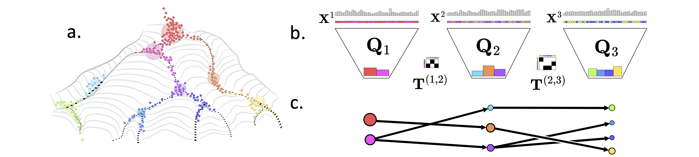

# Hidden Markov Optimal Transport (HM-OT)


**HM-OT** is a scalable algorithm for learning **cell-state transitions** in time-series single-cell datasets using the principle of **optimal transport**.


Given a time-series of datasets $X_1, X_2, \dots, X_N$, HM-OT learns:


- A sequence of **latent representations** $Q_1, Q_2, \dots, Q_N$ for each timepoint
- A set of **Markov transition kernels** $\tilde{T}^{(i,i+1)}$ between adjacent timepoints


For single-cell transcriptomics, this corresponds to learning:


- A set of **latent cell states** at each time
- The **least-action transition maps** that explain cellular differentiation across time


<p align="center">
 
</p>


*(Figure 1: HM-OT infers cell-state transitions between timepoints using optimal transport with a Hidden Markov structure.)*


To get started, clone the repository and install dependencies with:
```bash
git clone https://github.com/raphael-group/HM-OT.git
cd HM-OT
# Install dependencies
pip install -r requirements.txt
```


The main method for running HM-OT is in src/HiddenMarkovOT.py. See the demo notebook in notebooks/ for a full example.


**Folder Structure**
```bash
HM-OT/
├── src/                    # Source directory
│   ├── FRLC/               # Low-rank OT solver
│   ├── utils/              # Utility functions
       └── clustering.py   # Functions for computing clusterings
       └── util_LR.py   # Utilities for HM-OT preprocessing
       └── util_zf.py   # Other utilities
│   └── HiddenMarkovOT.py   # Main HM-OT interface
   └── plotting.py   # Plotting functions
├── notebooks/              # Example notebooks
   └── HM_OT_SingleCell_Demo.ipynb # Demo for diff-maps on single-cell
├── images/                 # Visual figures
│   └── Figure1.pdf
├── requirements.txt
└── README.md
```


**Contact**


If you have any questions or difficulties at all, feel free to reach out to Peter Halmos (ph3641@princeton.edu) or Julian Gold (jg7090@princeton.edu). We're happy to help!


If this work has been helpful to your research, feel free to cite our preprint:
```
@article{Halmos2025,
 title = {Learning Latent Trajectories in Developmental Time Series with Hidden-Markov Optimal Transport},
 url = {http://dx.doi.org/10.1101/2025.02.14.638351},
 DOI = {10.1101/2025.02.14.638351},
 publisher = {Cold Spring Harbor Laboratory},
 author = {Halmos,  Peter and Gold,  Julian and Liu,  Xinhao and Raphael,  Benjamin J.},
 year = {2025},
 month = feb
}
